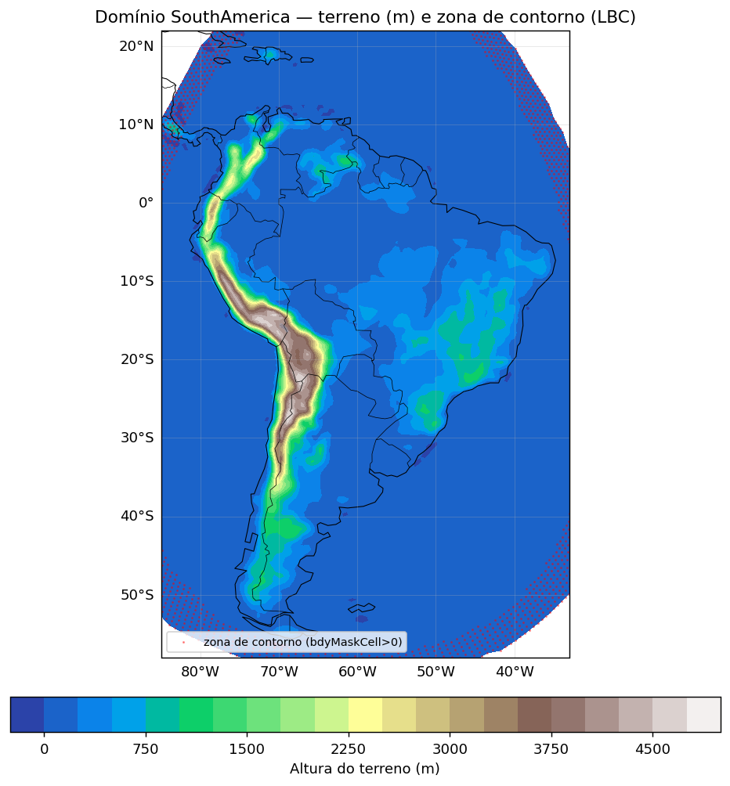
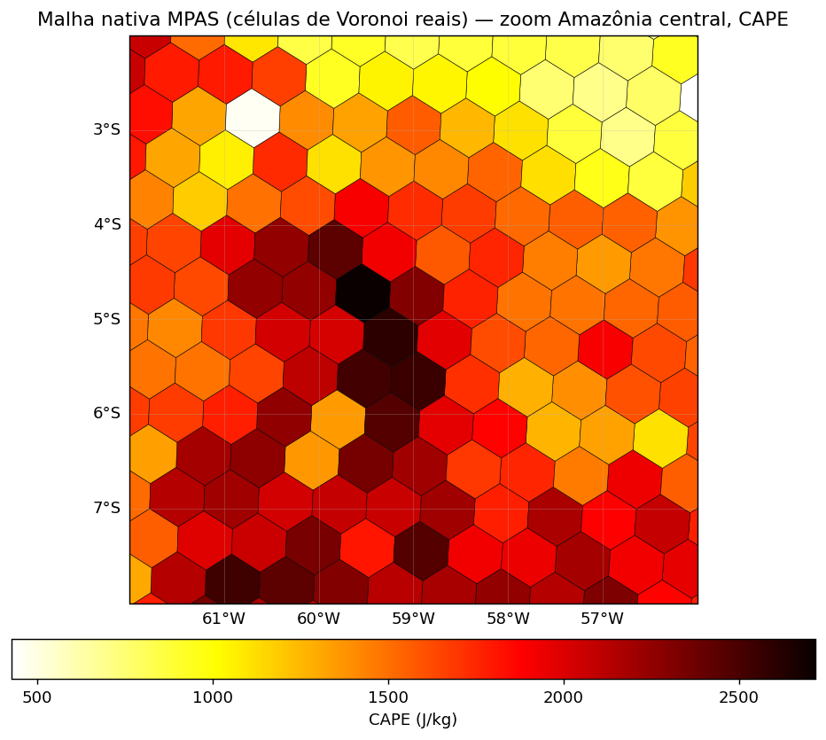
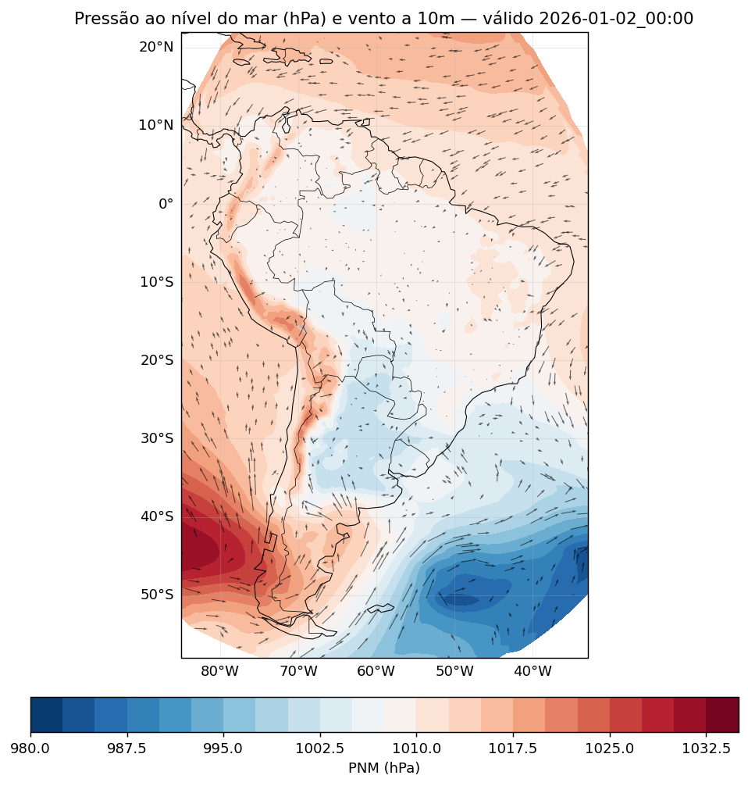
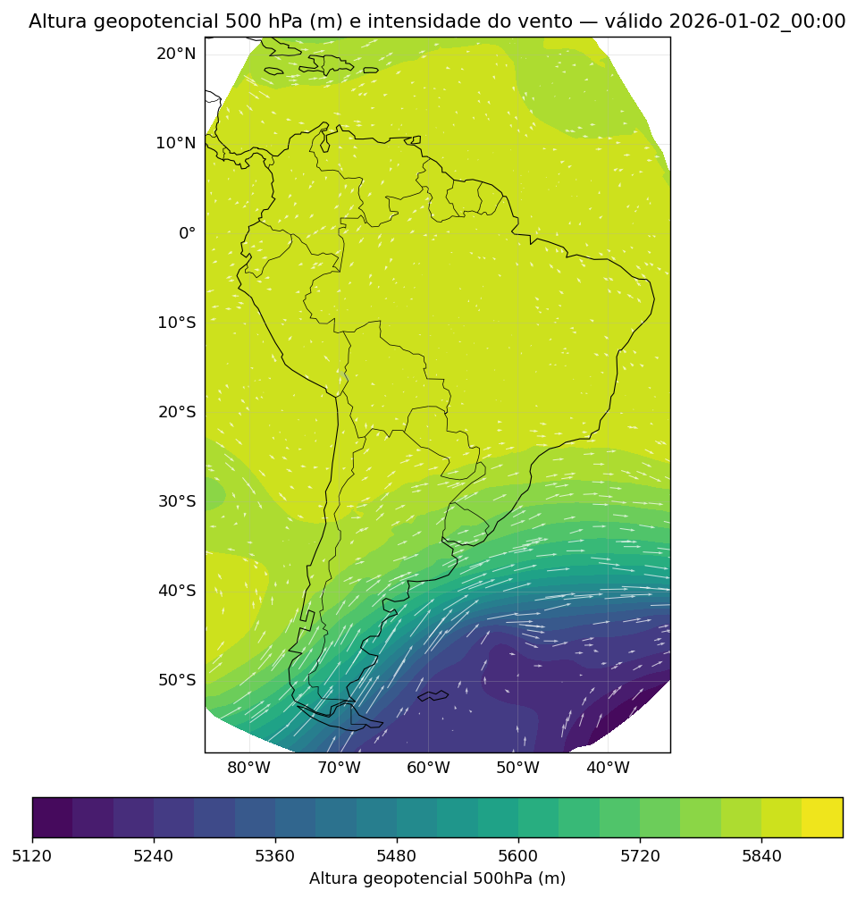
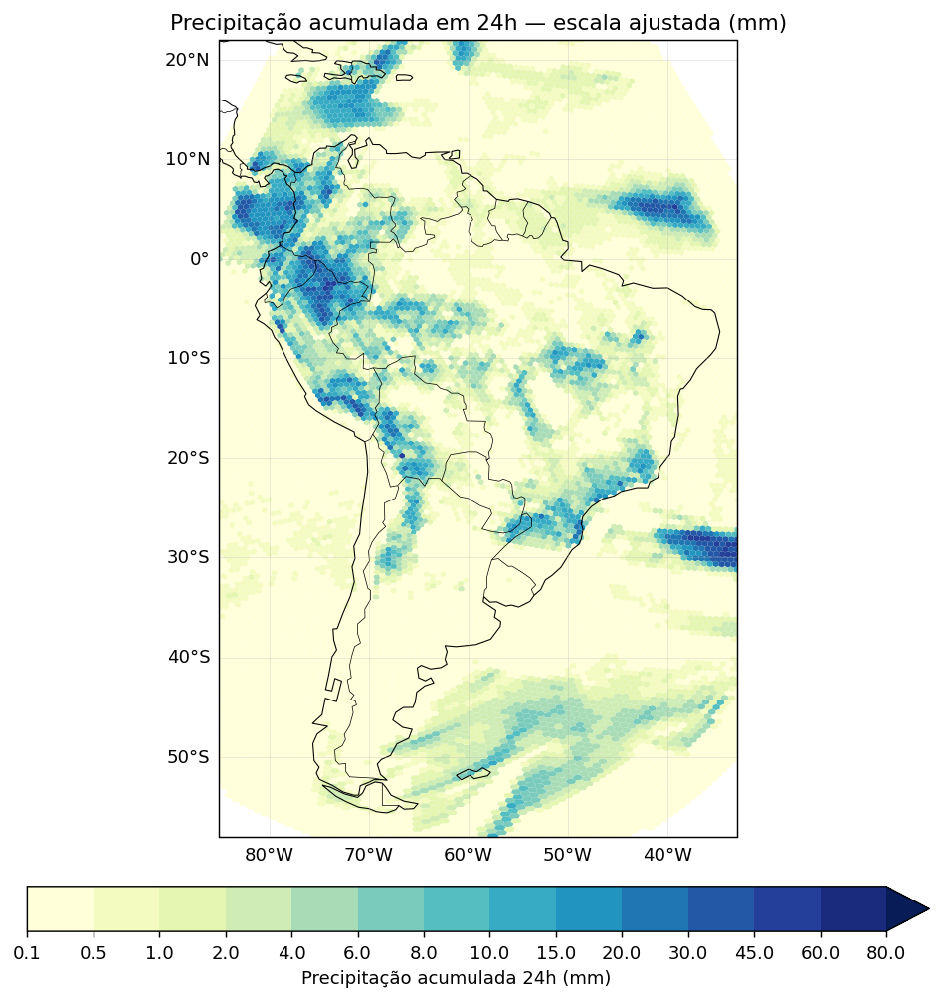
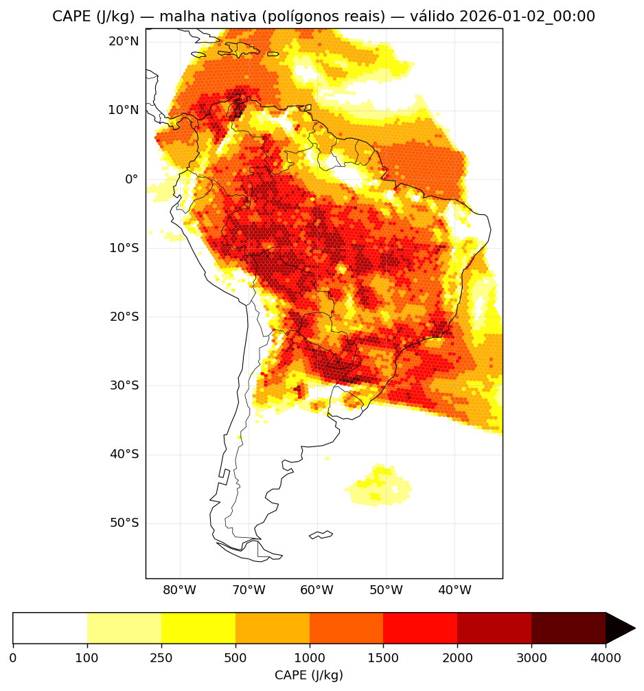
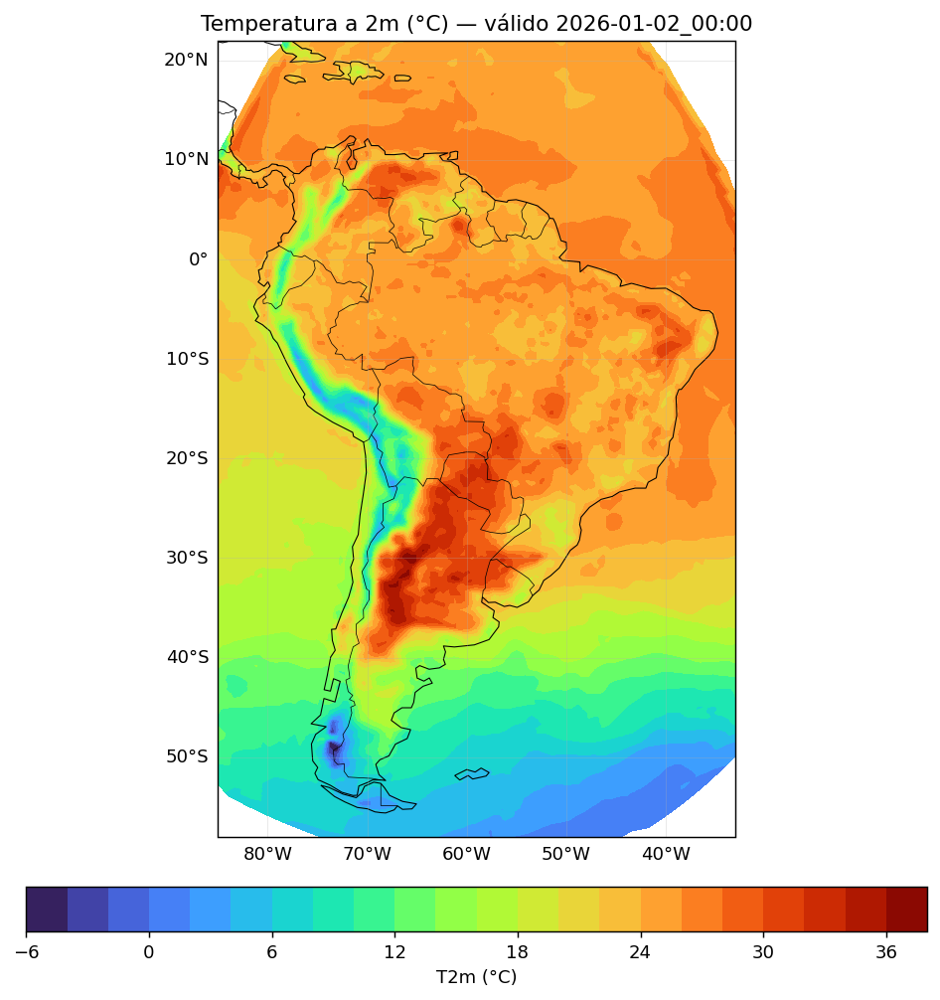
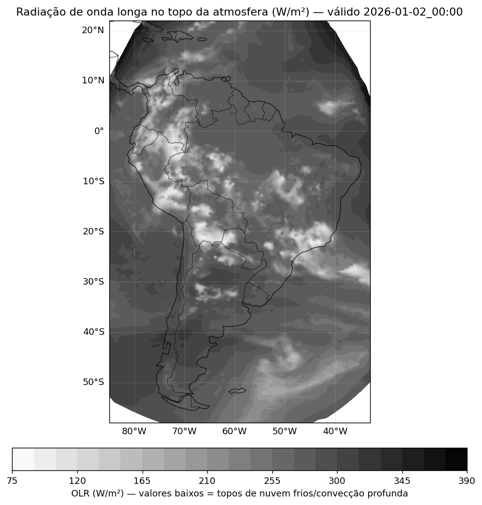
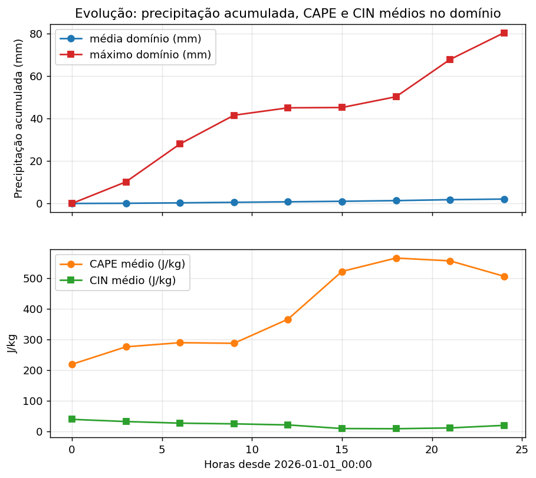

# selfgrib

> *self* + *GRIB* — porque o MPAS-A vira sua própria fonte de dados,
> sem precisar de nenhum GRIB externo (GFS, BAM, Eta...). Ele lê a própria
> saída global e usa pra alimentar a si mesmo. Autossuficiente, meio
> narcisista, mas funciona.

## O que é isso

Um "ungrib" alternativo para o MPAS-A: em vez de decodificar GRIB de um
modelo externo (GFS via `ungrib` do WPS, como normalmente se faz), essa
ferramenta lê a saída **nativa** de uma rodada global do próprio MPAS-A
(`history.nc`) e gera o mesmo formato binário intermediário que o
`init_atmosphere_model` já sabe consumir — permitindo criar condição
inicial e fronteira lateral para um novo domínio MPAS-A (regional ou
global) **sem nenhum patch no código-fonte do MPAS-Model**.

## Estrutura do repositório

```
mpas2intermediate/     -- o "selfgrib" propriamente dito (pipeline Fortran)
convert_mpas/           -- ferramenta da NCAR usada como dependencia (remapeamento horizontal)
MPAS-Limited-Area/      -- ferramenta da NCAR para recortar regioes da malha global
docs/                   -- referencias tecnicas (manuais MPAS-A, notas historicas)
```

Cada subdiretório tem seu próprio `README.md`/`HOWTO_*.md` com detalhes de
uso. Ponto de partida: [`mpas2intermediate/README.md`](mpas2intermediate/README.md)
— tem instruções de compilação, como rodar, e a documentação técnica
completa (de onde vieram as funções adaptadas, método de interpolação,
campos gerados, bugs encontrados e corrigidos no caminho).

## Resultado que essa pipeline pode produzir

Ponta a ponta, sem GRIB externo: a partir de uma rodada global do próprio
MPAS-A, o `selfgrib` gera condição inicial e fronteira lateral, que alimentam
o `init_atmosphere_model` e o `mpas_atmosphere` normalmente. Abaixo, uma
previsão regional de 24h (malha `SouthAmerica`, recorte de `x1.163842`,
$\sim$60\,km de resolução) gerada inteiramente por esse caminho, para dar
uma ideia visual do que sai no final.

<table>
<tr>
<td width="50%">
<br>
<sub><b>Domínio da malha regional</b>: terreno (m) e zona de fronteira/relaxamento (LBC) em vermelho.</sub>
</td>
<td width="50%">
<br>
<sub><b>Malha nativa MPAS</b>: células de Voronoi reais (hexágonos/pentágonos, sem suavização), zoom na Amazônia central, coloridas por CAPE.</sub>
</td>
</tr>
<tr>
<td width="50%">
<br>
<sub><b>Pressão ao nível do mar + vento a 10m</b> em 24h — ciclone extratropical bem definido no sul.</sub>
</td>
<td width="50%">
<br>
<sub><b>Altura geopotencial e vento em 500 hPa</b> — jato subtropical visível.</sub>
</td>
</tr>
<tr>
<td width="50%">
<br>
<sub><b>Precipitação acumulada em 24h</b> — máximo no Chocó/costa do Pacífico, padrão fisicamente coerente.</sub>
</td>
<td width="50%">
<br>
<sub><b>CAPE</b> ao final das 24h — máximo amazônico consistente com ciclo diurno convectivo.</sub>
</td>
</tr>
<tr>
<td width="50%">
<br>
<sub><b>Temperatura a 2m</b> válida em 24h.</sub>
</td>
<td width="50%">
<br>
<sub><b>Radiação de onda longa no topo da atmosfera (OLR)</b> — proxy de convecção profunda.</sub>
</td>
</tr>
</table>



*Evolução temporal (0–24h) de precipitação, CAPE e CIN médios no domínio —
crescimento físico de 0 a ~80mm acompanhando o ciclo diurno CAPE-cima/CIN-baixo.*

Todas as figuras (mais detalhes de método, bugs de interpolação
encontrados/corrigidos e equações usadas) estão documentadas em
[`mpas2intermediate/README.md`](mpas2intermediate/README.md#61-bugs-reais-encontrados-durante-o-desenvolvimento-e-correção)
e na seção 9 do mesmo arquivo (pontos em aberto no MPAS-Model upstream).

## Origem

Nasceu de uma pergunta simples: "dá pra gerar condição inicial do MPAS-A
usando uma rodada global do próprio MPAS-A, em vez de depender de GRIB
externo?" A resposta, depois de bastante investigação no código-fonte do
`init_atmosphere_model` e comparação direta com arquivos de produção reais,
foi sim — e o resultado está aqui.
