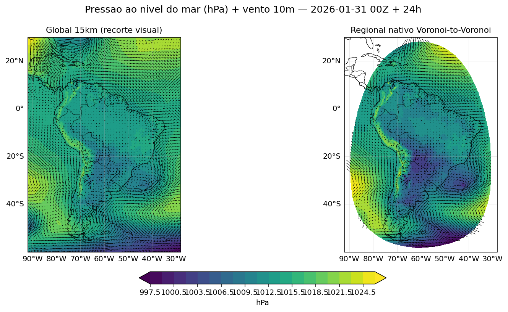
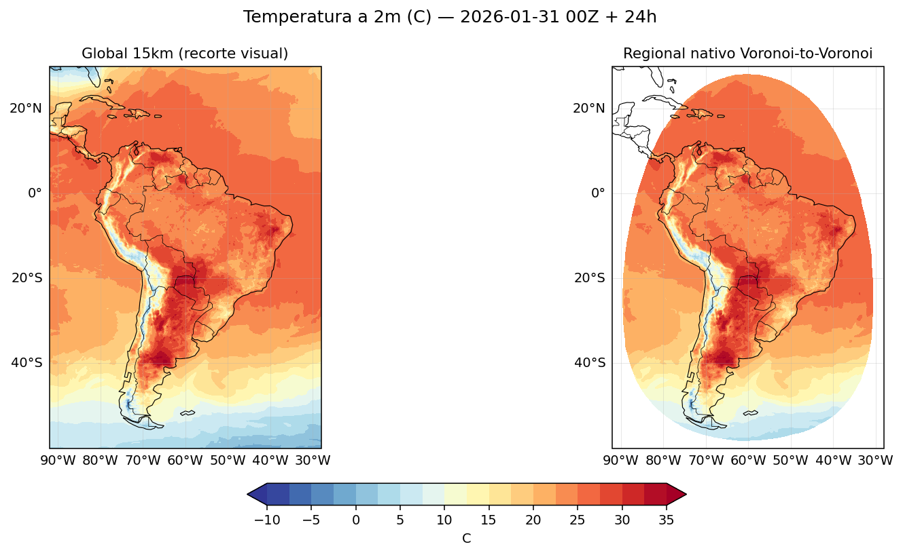
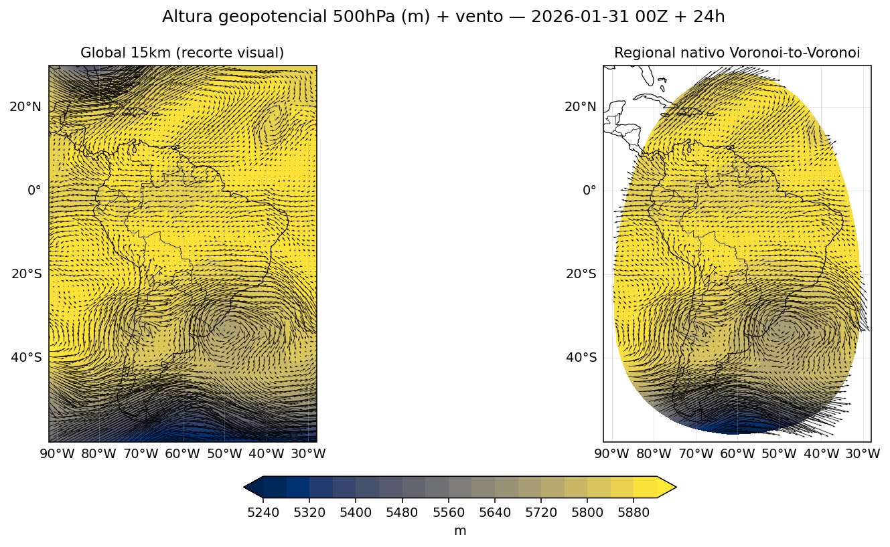
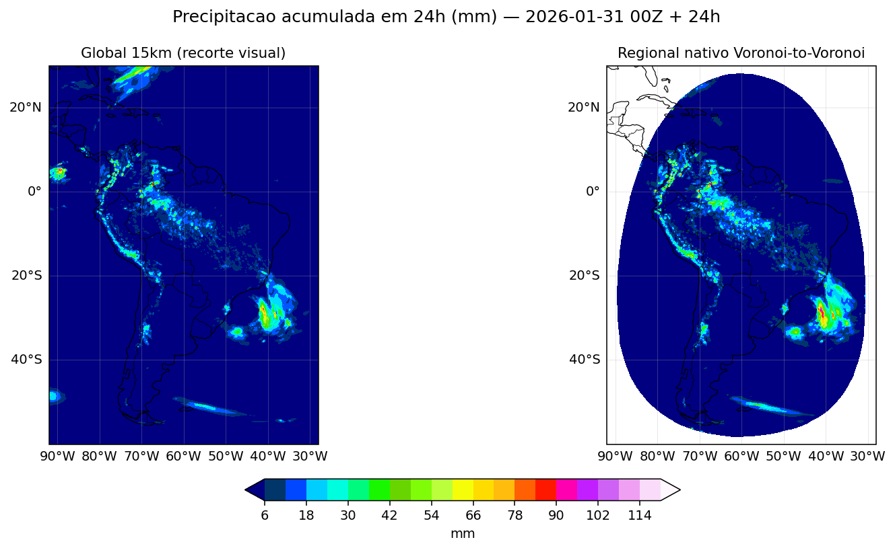
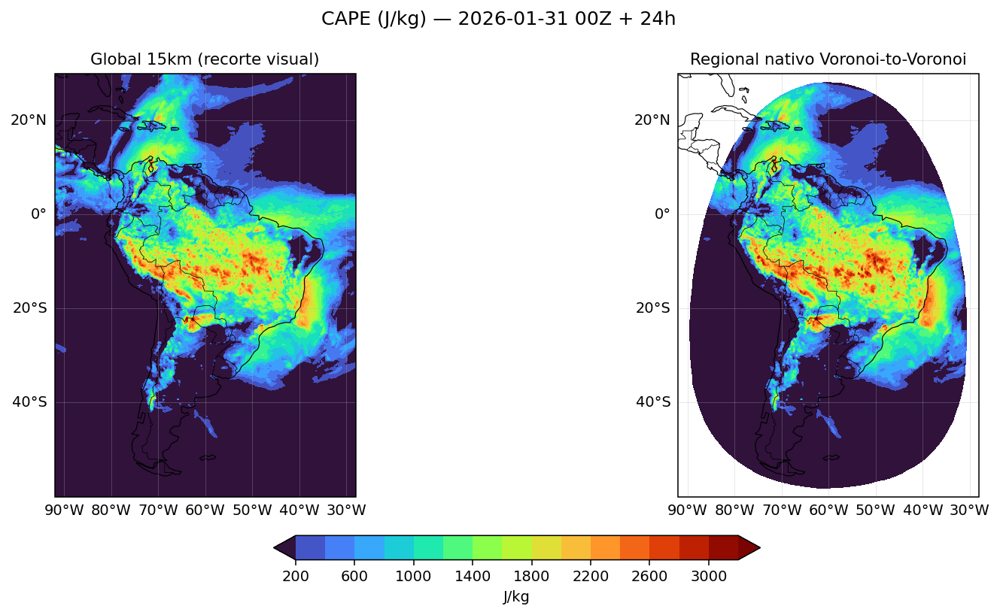
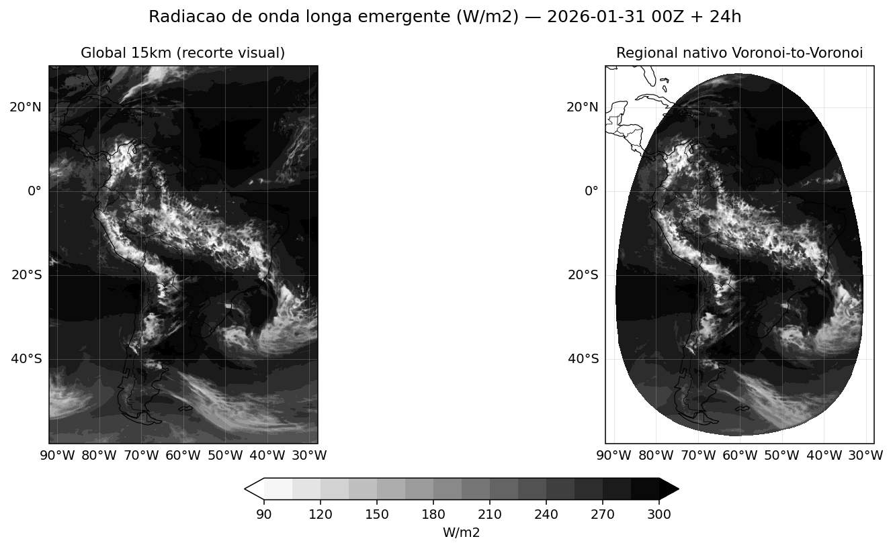

# Experimento: malha global 15km + Voronoi-to-Voronoi regional

Scripts usados para rodar o MPAS-A ponta-a-ponta na malha global de 15km
(`x1.2621442`) no Jaci e, a partir dessa previsão, testar a rota nativa
Voronoi (`core/pipeline/native/`) recortando e prevendo uma região
(`SouthAmerica`) usando a própria previsão de 15km como first-guess — em vez
do GFS/WPS usado no caso original de 60km.

Qualquer pessoa que clonar este repositório pode reproduzir o processo
inteiro ajustando só os caminhos de ambiente (ver "Reprodução em outro
ambiente" abaixo) — os scripts leem tudo via `${VAR:-default}`.

## Pré-requisitos

- Cluster com PBS + MPICH (testado no Jaci, CPTEC/INPE — ver
  `Mpich_hydra_jaci_optimization.MD` no repositório para as particularidades
  do ambiente: `select=1` sempre, `-iface hsn0`, etc.).
- MPAS-A (`init_atmosphere_model`/`mpas_atmosphere`) já compilado — os
  scripts usam por padrão um build `single` precision.
- WPS/`ungrib.exe` compilado, com dados GFS 0.25° disponíveis (local ou via
  repositório oficial) cobrindo o período desejado.
- Malha global 15km baixada: `x1.2621442.tar.gz` (grid/graph.info) e
  `x1.2621442_static.tar.gz` (static.nc) — extraídos em `grid/` e `static/`
  dentro do diretório do experimento.
- Para a etapa Voronoi-to-Voronoi: `core/src` e `core/vendor/convert_mpas`
  compilados (`cd core && make`) e NCO (`ncks`) no PATH.

## Estrutura esperada em tempo de execução

Tudo fica dentro de um único diretório-base (`DIR_BASE`, por padrão
`.../SOURCE/rodada_global_15km/`), isolado de outros experimentos:

```
DIR_BASE/
├── grid/, static/          # malha 15km extraída dos tar.gz
├── FILE_BASE_15km/         # namelists/streams adaptados (dt=90s, config_len_disp=15000 — ver "Achados" abaixo)
├── invariant/              # x1.2621442.invariant.nc (gerado 1x)
├── init/<TIMESTAMP>/       # ungrib + init_atmosphere_model
├── forecast/<TIMESTAMP>/   # previsão global 24h (history/diag)
├── selfgrib/               # clone do selfgrib (branch chore/reorganiza-estrutura-core)
├── recorte_SouthAmerica/   # malha regional recortada + init/lbc/forecast nativos
├── scripts/                # os 7 scripts deste diretório, copiados para cá
├── master.log, status_atual.txt   # acompanhamento em tempo real do passo 6
```

## Ordem de execução

1. **Extrair a malha 15km** em `grid/` e `static/` dentro de `DIR_BASE`.
2. **Gerar o invariant** (1x por malha): `qsub scripts/job_invariant_15km.sh`
3. **Previsão global de 24h**: `qsub scripts/submete_jaci_15km.pbs`
   (chama `master_run_15km.bash` → `run_mpas_atmosphere_15km.bash` →
   `run_mpas_forecast_15km.bash`)
4. **Voronoi-to-Voronoi regional** (usa o `history.*.nc` do passo 3 como
   first-guess): `qsub scripts/submete_voronoi_regional.pbs` (chama
   `master_voronoi_regional.bash`, que orquestra os 6 passos de
   `core/pipeline/{01_recorta_regiao.bash, native/02..06_*.bash}`)

## Reprodução em outro ambiente

Os scripts leem os caminhos via `${VAR:-default}`, com `DIR_ROOT` como raiz
de tudo (build, WPS, ambiente). Para rodar em outro cluster/diretório, basta
exportar antes de chamar `qsub` (ou editar o topo dos `.pbs`, que não herdam
o ambiente do shell de submissão por padrão):

```bash
export DIR_ROOT=/caminho/para/seu/workdir
export DIR_BASE=/caminho/para/este/experimento
# ver cada script para variáveis mais específicas (DIR_DATAIN_GFS, PTS_FILE, etc.)
```

## Achados/bugs corrigidos durante esta rodada (2026-09-10/11)

Documentado aqui porque cada um custou uma rodada real perdida — útil para
quem for adaptar estes scripts para outra malha/resolução:

- **`config_dt`/`config_len_disp` não escalam sozinhos**: o template de
  60km usava `config_dt=360.0`/`config_len_disp=60000.0`. Para 15km, a regra
  prática do MPAS (`dt[s] ≈ 6×dx[km]`) exige `config_dt=90.0` e
  `config_len_disp=15000.0` — sem isso o resultado seria fisicamente
  inconsistente (nunca chegou a rodar até o fim para confirmar a
  instabilidade, a correção foi aplicada antes).
- **`link_grib.csh` com glob cego pega GFS demais**: `f*.grib2` sem
  restringir o forecast hour casa com todo o repositório oficial (até
  ~384h) quando essa fonte está disponível, processando ~30x mais dado que
  o necessário no `ungrib.exe`. Corrigido construindo a lista explícita de
  forecast hours a partir de `RUN_DURATION`.
- **Formato do arquivo do repositório GFS oficial difere do backup local**:
  `gfs.t00z.pgrb2.0p25.f000.<TIMESTAMP>.grib2` (timestamp *depois* do
  forecast hour) vs. `gfs.0p25.<TIMESTAMP>.f000.grib2` no backup — um glob
  por forecast-hour individual (`f000.*grib2`) cobre os dois formatos.
- **NetCDF clássico não aguenta a malha 15km**: `extract_fields`,
  `gen_vertical_grid`, `gen_init_native` e `gen_lbc_native` (em
  `core/src/`) criavam os arquivos de saída com `NF90_CLOBBER` puro (limite
  de ~2GiB por variável não-record). Com a malha global de 2.621.442
  células a 61 níveis de pressão, isso estourava (`extract_fields`
  concretamente). Corrigido para CDF-5 (`NF90_64BIT_DATA`) nos 4 pontos —
  ver commit no histórico do `core/src`.
- **`DIR_OUT` colidindo entre passos do pipeline nativo**: exportar
  `DIR_OUT` globalmente no script master (pensado só para o passo 1, o
  recorte) vazava para os passos 2/3 (`02_extrai_first_guess.bash`,
  `03_interp_horizontal_nativa.bash`), que também usam uma variável
  `DIR_OUT` (default `.../native_intermediate`) — o passo 2 passou a
  escrever fora do lugar esperado pelo passo 3. Corrigido passando
  `DIR_OUT` só no escopo do comando do passo 1.
- **Concatenação errada do `START_TIME`**: `"${INIT_TIME}_00:00:00"` com
  `INIT_TIME="2026-01-31_00"` (que já inclui a hora) gera
  `"2026-01-31_00_00:00:00"` — data inválida, que o `mpas_atmosphere`
  rejeita com `ERROR: Invalid DateTime string`, derrubando com SIGSEGV os
  256 ranks MPI simultaneamente. Corrigido para `"${INIT_TIME}:00:00"`.
- **`graph.info.part.*` disponíveis para a malha 15km baixada**: só
  `{240,256,480,512,960,1024,1920,2048,3840,4096}` — não há `.part.64` nem
  `.part.128` (diferente da malha 60km). `NP=256` foi escolhido por ser o
  menor disponível e também o teto de 1 nó físico do Jaci
  (`select=2` com MPICH falha por SSH inter-nó, nunca usar).

## Resultados

Gerados por `scripts/plot_resultados.py` a partir dos `diag.*.nc` das duas
previsões (`t=24h`, válido 2026-02-01 00Z), lendo a malha global (15km,
2.621.442 células) e a malha regional (`SouthAmerica`, 233.732 células,
recortada da própria malha global) diretamente pelas coordenadas nativas
(`latCell`/`lonCell`), sem passar por WPS/GFS na etapa regional.

Não é uma comparação com o caso de 60km já documentado no README principal
(datas diferentes, não há como comparar diretamente) — é uma validação de
que a rota nativa Voronoi-to-Voronoi reproduz fielmente a física da
previsão global usada como first-guess, agora numa malha própria (15km) em
vez do GFS usado no teste original.

| Campo | Global 15km × Regional nativo |
|---|---|
| MSLP + vento 10m |  |
| Temperatura 2m |  |
| Geopotencial 500hPa + vento |  |
| Precipitação acumulada 24h |  |
| CAPE |  |
| OLR |  |

Os seis campos mostram estrutura praticamente idêntica entre as duas rotas
— mesmo vórtice de baixos geopotenciais em ~40°S/50°W, mesma banda de
convecção/CAPE elevado sobre a Amazônia, mesmo padrão de OLR — consistente
com o que já era esperado (a rota nativa não deveria introduzir divergência
visível numa previsão de 24h a partir do mesmo first-guess).

### Comparação "antes/depois" com o caso original de 60km

`scripts/plot_estilo_original.py` gera, no mesmo estilo/nomes de arquivo do
caso de 60km em [`docs/resultados_voronoi/`](../../docs/resultados_voronoi/),
os 9 gráficos equivalentes para a previsão regional `SouthAmerica` recortada
da malha global de 15km — em
[`docs/resultados_voronoi_15km/`](../../docs/resultados_voronoi_15km/). A
comparação lado a lado dos dois conjuntos está no
[README principal do repositório](../../README.md#antes--depois-mesma-rota-malha-de-origem-60km--15km).
